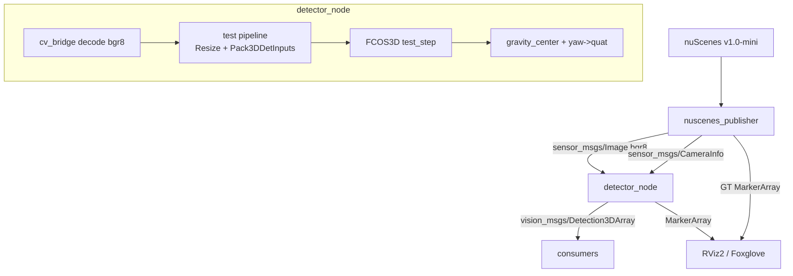
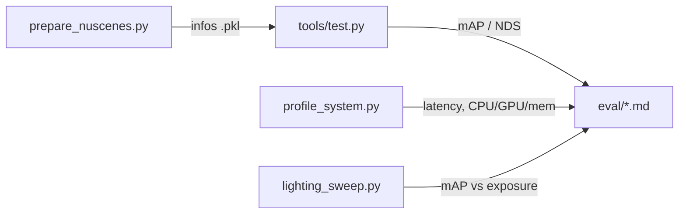

# sim2real-fcos3d-ros2 — Architecture Documentation

## 1. How to Read This Document

Persistent architectural context for anyone (human or agent) working on this
repository. It records what is expensive to re-derive: the version matrix that
the stack will not tolerate deviation from, the coordinate conventions that
fail silently when wrong, and the reasons behind non-obvious implementation
choices.

Read §3 and §8 before touching anything. Most of the project's lost time came
from violating one of those two sections.

**Project type**: Data/ML Pipeline (primary), CLI tooling (secondary),
ROS 2 robotics middleware (domain).

---

## 2. Overview

Applies a **pretrained** FCOS3D monocular 3D object detector to autonomous
driving data inside a ROS 2 Humble pipeline, then evaluates it for accuracy,
latency and resource utilisation across GPU environments. No training occurs
anywhere in this repository.

Two runtime paths share one inference implementation:

| Path | Entry point | Purpose |
| --- | --- | --- |
| **Live** | `detector_node` + `nuscenes_publisher` | ROS 2 topic-based detection, the deliverable system |
| **Offline** | `scripts/*.py` | Evaluation, profiling, sweeps, video rendering |

The offline scripts deliberately reproduce the node's in-memory preprocessing
rather than using a separate batch path, so measurements describe the deployed
node rather than a benchmark harness.

---

## 3. Technology Stack

**The version matrix is load-bearing. The official MMDetection3D install
documentation is wrong** — `mim install 'mmcv>=2.0.0rc4'` resolves to mmcv
2.2.x and fails mmdet3d's own import-time assert. Real bounds come from the
asserts in `mmdet3d/__init__.py`.

| Component | Pinned | Hard constraint | Why |
| --- | --- | --- | --- |
| Ubuntu | 22.04 | — | ROS 2 Humble; 24.04 means Jazzy |
| Python | 3.10 | — | prebuilt `cp310` mmcv wheel exists |
| CUDA | 11.8 | ≤ sm_90 | no Blackwell (RTX 5090, B200) support |
| torch | 2.1.0+cu118 | — | matches the mmcv wheel index |
| mmengine | 0.10.4 | `>=0.8.0,<1.0.0` | mmdet3d assert |
| mmcv | 2.1.0 | `>=2.0.0rc4,<2.2.0` | mmdet3d assert |
| mmdet | 3.3.0 | `>=3.0.0rc5,<3.4.0` | mmdet3d assert |
| mmdet3d | 1.4.0 | — | final release; project is archived |
| numpy | 1.26.4 | `<2.0` | mmcv compiled against the numpy 1.x ABI |
| scipy | 1.13.1 | numpy 1.x build | wheels built for numpy 2 crash on numpy 1 |
| nuscenes-devkit | 1.1.11 | — | official evaluation |
| lyft-dataset-sdk | any | required | `mmdet3d.evaluation` imports `lyft_eval` at module scope |

**Base image**: `runpod/pytorch:2.1.0-py3.10-cuda11.8.0-devel-ubuntu22.04`.
This tag is not incidental — it is the only readily available image satisfying
the Ubuntu/Python/CUDA/torch chain simultaneously.

---

## 4. Project Structure

```
src/fcos3d_ros2/            ament_python ROS 2 package
  fcos3d_ros2/
    detector_node.py        FCOS3D inference node (subscribes camera, publishes boxes)
    nuscenes_publisher.py   dataset replay + ground-truth markers
    fp16_compat.py          fp32 patch for the decode step under autocast
  launch/detector.launch.py
  setup.py / setup.cfg / package.xml
configs/
  fcos3d_nus_mini.py        eval config overriding the hardcoded trainval version
scripts/
  setup_pod.sh              full environment bootstrap (authoritative)
  get_nuscenes_mini.sh      dataset fetch + extraction
  prepare_nuscenes.py       info .pkl generation
  smoke_test.py             offline test of the node's inference path
  profile_system.py         latency / throughput / CPU / GPU / memory
  lighting_sweep.py         controlled photometric sweep
  render_demo.py            projects boxes onto video
  build_demo_video.py       assembles the demo video
  pod.sh                    SSH helper for the Runpod proxy
eval/                       all results (markdown + raw JSON)
docs/                       report, ARCHI, code reviews, media
```

---

## 5. Core Architecture Principles

1. **One inference path.** The node's preprocessing (`_preprocess`) is the
   reference. Scripts replicate it rather than inventing a batch path, so a
   measurement describes the deployed system.
2. **Make silent failures visible.** Ground truth is published in the same
   frame as predictions specifically so a frame mismatch shows up in a viewer
   instead of corrupting a metric.
3. **Pin from source, not documentation.** Version bounds are read from library
   asserts. Constraints apply from the first install, never as repair.
4. **Record the reason, not just the fix.** Non-obvious code carries the
   failure it prevents. See `fp16_compat.py`, `configs/fcos3d_nus_mini.py`.
5. **Accuracy from the canonical evaluator.** Detection metrics come from
   mmdet3d's `tools/test.py`; hand-rolling the camera→ego→global transform was
   rejected as too easy to get confidently wrong.

---

## 6. Build System & Toolchain

```bash
bash scripts/setup_pod.sh                      # environment (~20 min)
bash scripts/get_nuscenes_mini.sh "<url>"      # dataset
source /opt/ros/humble/setup.bash
colcon build --symlink-install && source install/setup.bash
```

`setup.cfg` is **required**: without it setuptools installs console scripts to
`install/<pkg>/bin/` while `ros2 run` looks in `install/<pkg>/lib/<pkg>/`. The
build succeeds and the executables are invisible.

Adding a `console_scripts` entry needs a clean rebuild (`rm -rf build install
log *.egg-info`); `--symlink-install` reuses stale egg-info otherwise.

---

## 7. Configuration

**ROS parameters** — `detector_node`: `config_file`, `checkpoint_file`,
`device`, `fp16`, `score_threshold`, topic names, `marker_lifetime_sec`,
`log_every_n`. `nuscenes_publisher`: `dataroot`, `version`, `camera`,
`rate_hz`, `loop`, `frame_id`, `publish_gt`, `brightness_gain`, `gamma`.

**Paths** are absolute and pod-oriented (`/workspace/...`). mmdet3d configs use
a relative `data_root` of `data/nuscenes/`, and `update_infos_to_v2` hardcodes
`./data/nuscenes`, so the dataset **must** be reachable at
`<mmdetection3d>/data/nuscenes` — `get_nuscenes_mini.sh` creates that symlink.

---

## 8. Coordinate Conventions — the silent-failure zone

This section exists because every bug that cost more than an hour lived here.

**FCOS3D output** — `CameraInstance3DBoxes`, rows
`(x, y, z, x_size, y_size, z_size, yaw)`:

- Camera frame: **x right, y down, z forward** (= REP-103 camera *optical*
  frame, so boxes can be published unchanged in an optical frame).
- Origin `(0.5, 1.0, 0.5)` = **bottom centre**. Use `bboxes_3d.gravity_center`,
  never `tensor[:, :3]`, or every box sits half a height low.
- Dimensions are **(width, height, length)**.
- Yaw rotates about the **y** axis. The quaternion in
  `detector_node._yaw_to_quat_about_y` is **verified correct**: 0.0000 m corner
  mismatch against `CameraInstance3DBoxes.corners`, up to 2.66 m if negated.
  Do not "fix" the sign.

**Channel order** — the config sets `bgr_to_rgb=False` with caffe means
`[103.53, 116.28, 123.675]`. The model wants **BGR**. `cv_bridge` with `bgr8`
is correct; converting to RGB degrades accuracy with no error.

**Intrinsics** — must come from the *same camera* as the image. A glob of
`*CAM_FRONT*` also matches `CAM_FRONT_LEFT` (and sorts first, `'L' < '_'`).
That mismatch produced plausible boxes and cut detections from 200 to 19.

---

## Data Flow Diagrams





---

## Error Handling Strategy

- Missing `CameraInfo`: frames dropped with a throttled warning (5 s) rather
  than guessed intrinsics — a wrong guess is worse than no output.
- Unreadable frame / GT lookup failure: warned and skipped; replay continues.
- Missing required parameters: `RuntimeError` at construction, fail fast.
- Environment mismatch: `setup_pod.sh` asserts the version matrix at build
  time so failure occurs during setup, not mid-experiment.
- **Known gap**: `detector_node.on_image` has no `try/except`; a malformed
  frame propagates out of the callback (rclpy logs, node survives). Recorded in
  `docs/3-code-review/CR_w1_v0.1.0.md` (m4).

---

## Testing Strategy

**Current state: no automated test suite.** `scripts/smoke_test.py` is a manual
verification script. This is recorded as coverage debt in
`docs/3-code-review/CR_w1_v0.1.0.md`, not waived.

Invariants that should become regression tests, in priority order:

1. yaw→quaternion matches `CameraInstance3DBoxes.corners` (verified manually;
   guards a silent geometric failure)
2. `gravity_center` vs bottom-centre origin offset
3. camera/intrinsics pairing rejects a mismatched camera name
4. `DeterministicPhotometric` is a no-op at gain 1.0 / gamma 1.0

Functional checks currently standing in for tests: the sweep baseline
reproduces the unperturbed evaluation to four decimals, and detections/frame
are identical across GPUs (6.28).

---

## Performance Considerations

Measured, not assumed — see `eval/environment_comparison.md`.

- ~72 ms/frame, 13.85 FPS, 597 MB peak (RTX 4090, FP32).
- **GPU utilisation peaks near 54%** — the pipeline is *not* GPU-bound. Roughly
  half of wall time is preprocessing, kernel launch, box decoding and NMS.
- Consequence: FP16 helps a slow card (+6.8% on A40) and hurts a fast one
  (−3.9% on RTX 4090). TensorRT was dropped for this reason — it optimises the
  part that is not the bottleneck.
- Memory is not a constraint; VRAM should not drive GPU selection.

---

## Security Considerations

No credentials anywhere in the repository — a submission requirement. SSH keys
live only in `~/.ssh`. `scripts/pod.sh` reads pod identifiers from environment
variables. Dataset URLs are account-gated and passed as arguments, never
committed, because they are signed and expire.

---

## Deployment

Runpod GPU pod from the base image above; `setup_pod.sh` reproduces the
environment in one run (verified on two different machines). Runpod
**secure-cloud** pods have no public IP: SSH is via a PTY-only proxy that
supports neither `scp`/`sftp` nor TCP forwarding, and its HTTP proxy cannot
carry a WebSocket. Move code with `git`, move files with a temporary
`python3 -m http.server` on an exposed HTTP port.

---

## Conclusion

Key decisions, each with a reason recorded in the code:

1. **Rebuild the test pipeline in-memory** rather than use
   `inference_mono_3d_detector`, which requires an annotation file on disk and
   asserts image basenames match — unusable for a live `sensor_msgs/Image`.
2. **Install mmdet3d with `--no-deps`** to avoid open3d → Flask → blinker, a
   distutils package pip cannot uninstall. open3d is visualisation-only.
3. **Constrain every pip call from the first install.** Downgrading a compiled
   package leaves a mixed tree that fails in ways unrelated to the real cause.
4. **Accuracy from mmdet3d's evaluator**, system metrics from the node — each
   measured by the tool best suited to it, stated explicitly in the report.
5. **Isaac Sim scoped out**; a controlled photometric sweep on real images
   recovers the underlying question without claiming to be a simulator.
